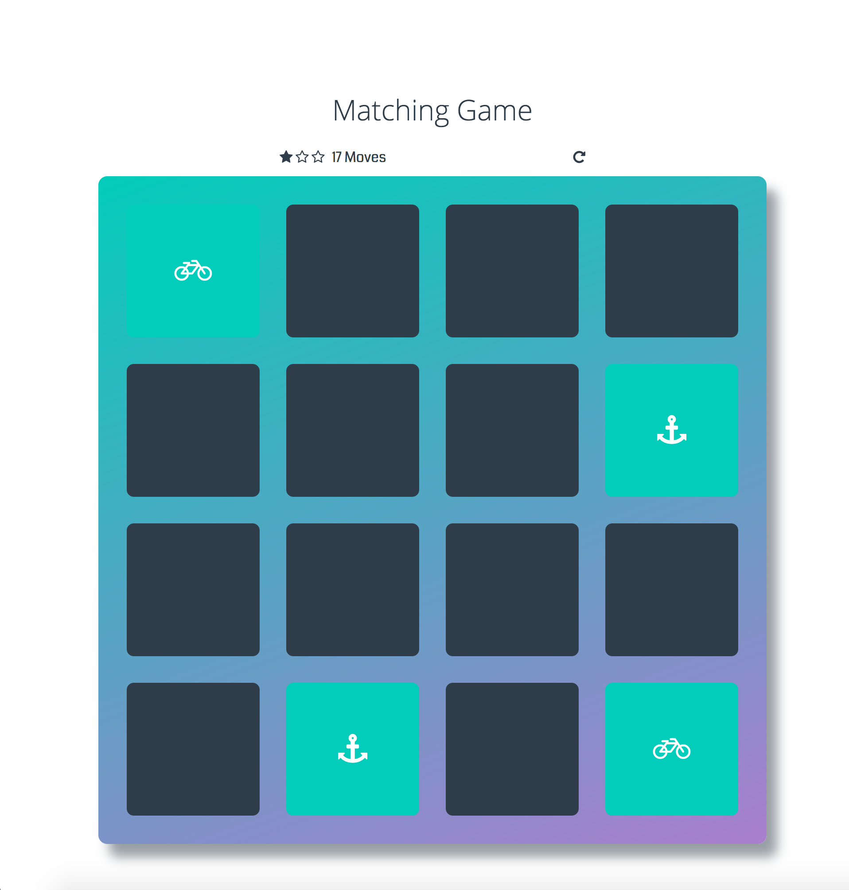

# Memory Game Project

## the Memory Game
This quick reminder game will help you test the strength of your memory 

## Instructions 
### How to Play!
you need to Match cards in less time with less moves.
* Click on a card
* Keep revealing cards and working your memory to remember each unveiled card.
* Match cards properly with less moves and in faster time

## How I built this Game
* created a deck of cards that shuffles when game is refreshed.
* created a counter to count the number of moves made by user and timer to know the duration of a play.
* added some animations to cards when they match and are unmatched
* created a pop-up modal "final windows" appear when player wins game